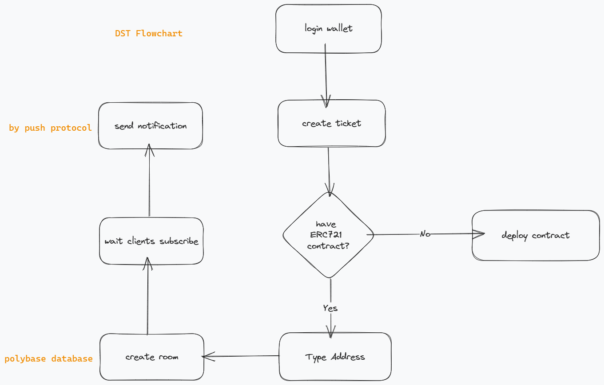

# Digital tickets stream

## Links

- youtube: <https://www.youtube.com/watch?v=mv54n62_t1M&ab_channel=ayden-hackathon>
- website: <https://digital-tickets-stream.vercel.app/>

## Overview

### Summary

`DTS` is a paid video ticketing platform where users can charge tickets from clients by creating ERC721 NFTs ticket, allow users to subscribe to broadcasting notifications.

### Features

- create room tickets
- send notifications
- withdraw ticket revenue

### Flowchart



### Code Snippet

#### Push Protocol

```javascript
//send notify.
const apiResponse = await PushAPI.payloads.sendNotification({
  signer: _signer,
  type: 4, // subset
  identityType: 2, // direct payload
  notification: {
    title: `${title} is kicking off.`,
    body: `click to join.`,
  },
  payload: {
    title: "live room is kicking off",
    body: `click to join the meeting`,
    cta: `https://iframe.huddle01.com/${roomId}`,
    img: "",
  },
  recipients: subs, // recipients addresses
  channel: "eip155:5:0x52bf58425cAd0B50fFcA8Dbe5447dcE9420a2610",
  env: "staging",
});
```

#### Polybase

```javascript
//database.
const db = new Polybase({
  defaultNamespace: process.env.NEXT_PUBLIC_NAME_SPACE,
});

db.signer((data) => {
  return {
    h: "eth-personal-sign",
    sig: ethPersonalSign(process.env.NEXT_PUBLIC_COMMON_PK, data),
  };
});

//add room info to database.
const recordRoomInfo = async (roomId, contractAddress) => {
  console.log(roomId, title, address);
  await collectionReference.create([
    roomId,
    title,
    address,
    contractAddress,
    Date.now(),
    description,
    price,
    checked ? 1 : 0,
  ]);
  // console.log(recordData);
};
```

#### Huddle01

```javascript
//create room via api.
const createRoom = async (contractAddress) => {
  axios
    .post(
      "https://api.huddle01.com/api/v1/create-iframe-room",
      {
        title: title,
        tokenType: "ERC721",
        contractAddress: [contractAddress],
        chain: "POLYGON",
        description: description,
        hostWallets: [address.toLowerCase()],
      },
      {
        headers: {
          "Content-Type": "application/json",
          "x-api-key": "x-api-key",
        },
      }
    )
    .then(async function (response) {
      if (response.status == 200) {
        await recordRoomInfo(response.data.data.roomId, contractAddress);
        cleanData();
        setLoading(false);
        alertService.info("success!", options);
      }
    })
    .catch(function (error) {
      console.log(error);
      return;
    });
};
```

## Support Chains

- Ploygon

## Document tree

```shell
$ tree -d -L 2 -I 'node_modules'
digital-tickets-stream
├── components     (react.js components)
├── contract       (hardhat contract)
│   ├── artifacts
│   ├── cache
│   ├── contracts
│   ├── scripts
│   └── test
├── pages          (frontend pages)
│   └── api        (send push protocol notify api)
├── public
├── services
└── styles

```

## Test

```shell
cd contract
npx hardhat test
```

## Reference

- [1] push procotol https://push.org/
- [2] polybase database https://polybase.xyz/
- [3] huddle01 https://www.huddle01.com/
- [4] tailwindcss https://tailwindcss.com/
- [5] dasyUi https://daisyui.com/
- [6] next.js https://nextjs.org/
- [7] ether.js https://docs.ethers.org/v6/
- [8] hardhat https://hardhat.org/

## License

SPDX short identifier: MIT
