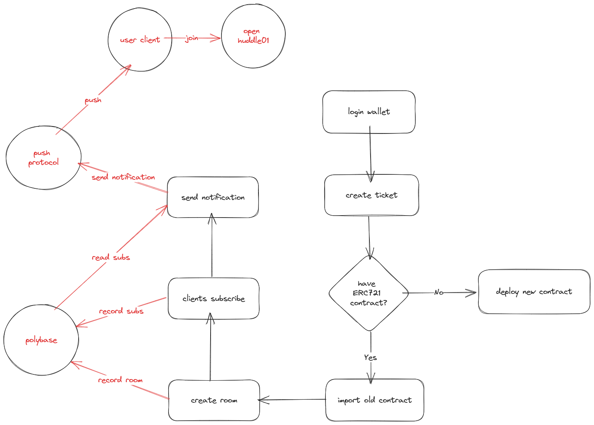

# Digital tickets stream

## Links

- youtube:
- website:

## Overview

### Summary

`DTS` is a paid video ticketing platform where users can charge tickets from clients by creating ERC721 NFTs ticket, allow users to subscribe to broadcasting notifications.

### Features

- create room tickets
- send notifications
- withdraw ticket revenue

### Flowchart

## Support Chains

Ploygon

## Document tree

## Test

## Reference

- [1] push procotol https://push.org/
- [2] polybase database https://polybase.xyz/
- [3] huddle01 https://www.huddle01.com/
- [4] tailwindcss https://tailwindcss.com/
- [5] dasyUi https://daisyui.com/
- [6] next.js https://nextjs.org/
- [7] ether.js https://docs.ethers.org/v6/
- [8] hyperlane https://www.hyperlane.xyz/
- [9] hardhat https://hardhat.org/

## License

SPDX short identifier: MIT
